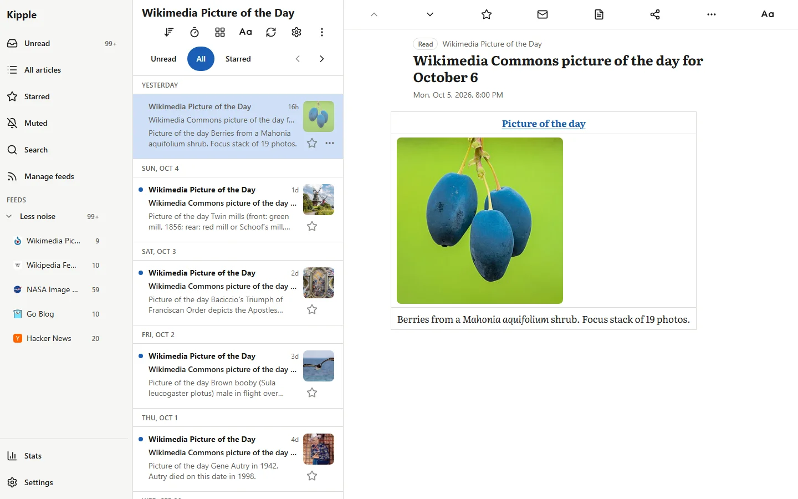
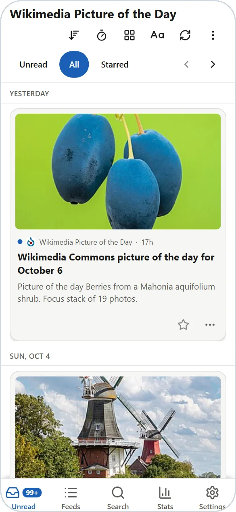

# Kipple

> *When nobody's around, kipple reproduces itself.*
>
> Philip K. Dick, *Do Androids Dream of Electric Sheep?* (1968)

A self-hosted RSS reader. One Docker container, one port, one SQLite database.

[](https://github.com/WPTK/Kipple/actions/workflows/ci.yml)
[](https://github.com/WPTK/Kipple/releases)
[](LICENSE)
[](https://github.com/WPTK/Kipple/pkgs/container/kipple)

<table>
  <tr>
    <td valign="bottom">
      <picture>
        <source media="(prefers-color-scheme: dark)" srcset="docs/screenshots/desktop-dark.webp">
        
      </picture>
    </td>
    <td valign="bottom">
      <picture>
        <source media="(prefers-color-scheme: dark)" srcset="docs/screenshots/phone-dark.webp">
        
      </picture>
    </td>
  </tr>
  <tr>
    <td><sub><b>Web app.</b> Feeds on the left, the article list in the middle, the open article on the right.</sub></td>
    <td><sub><b>On a phone.</b> Add Kipple to the home screen and it opens full screen, like an app.</sub></td>
  </tr>
</table>

Kipple is in beta. It is in daily use, and 1.0 follows more testing. [CHANGELOG.md](CHANGELOG.md) lists what shipped in
each release.

## What you get

- Five ways to browse a feed: large lead images with an excerpt, a grid of photo cards, a plain list without pictures,
  email-style rows, or one line per title. Set it per device or per feed.
- 20 color themes, with separate picks for day and night, and 11 bundled reading fonts.
- Nested folders for organizing feeds.
- Import feeds from your old reader and export them any time (OPML).
- Search, saved searches, and keyword filters that mute, star, highlight or mark articles read.
- Choose how many articles each feed keeps, from 50 to unlimited. Starred articles are never deleted.
- Runs as a phone app, installed from your browser. Articles you have opened still read offline.
- Syncs with RSS apps on your phone or computer.
- Reading statistics and a yearly Wrapped summary, stored only in your own database.
- Backup and restore are built in.
- Designed for a single-user environment.

## Install

Pull the image and start it. Replace `<version>` with the newest tag on the
[releases page](https://github.com/WPTK/Kipple/releases) (the `latest` tag exists from the first stable release).

```
docker run -d --name kipple --restart unless-stopped -p 127.0.0.1:1919:1919 -v kipple_data:/data ghcr.io/wptk/kipple:<version>
```

Open <http://127.0.0.1:1919>. The first screen creates your account. The setup wizard after it asks for your
time zone, a theme, an OPML import from your old reader, a few starter feeds, and the address your other devices will
use. Every step after the account can be skipped.

Until you create the account, anyone who can reach the port can. The command above publishes the port on `127.0.0.1`
only, so only this machine can. Widen it after you have an account.

The [deploy guide](docs/deploy.md) covers the compose file, reaching Kipple from your phone or over HTTPS, backups,
upgrades, verifying the image signature and building from source.

## Sync with other apps

Kipple can sync read and starred articles with RSS apps on your phone or computer. In the app, add a FreshRSS (Google
Reader compatible) account with:

- Server: your Kipple address plus `/api/greader.php`
- User name: the one you chose during setup
- Password: the API password. The last setup step shows it, and Settings, Account & Devices can make a new one.

## What Kipple leaves out

These are left out on purpose, and requests for them are closed.

- Native support for podcasts, audio and video. A media link in an article still opens.
- Webhooks and other integrations with outside services.
- Tags. Feeds live in folders, and articles can be starred.
- AI features.
- Notifications.
- Social features. You can still share an article from the web app: it opens your device's share sheet, or copies the link.
- Monitoring or analytics.\*
- More than one user.

\* Kipple keeps reading statistics, but they live in your own database, only you see them, and nothing sends them anywhere.

## Documentation

- [Deploy guide](docs/deploy.md): install options, ports, backups, restore, upgrades, Cloudflare Access.
- [Reverse proxy](docs/reverse-proxy.md): HTTPS with Caddy, nginx or Traefik.
- [Troubleshooting](docs/troubleshooting.md)
- [Design](docs/design.md) and [UI decisions](docs/ui-decisions.md): how it works and why.
- [Performance](docs/performance.md): 500 feeds and 150,000 articles, measured.
- [All docs](docs/README.md)

To report a bug, open an [issue](https://github.com/WPTK/Kipple/issues). To send a change, read
[CONTRIBUTING.md](CONTRIBUTING.md). Vulnerabilities go through [SECURITY.md](SECURITY.md).

## License

[Blue Oak Model License 1.0.0](LICENSE): use, modify and share it, including commercially. Third-party licenses are in
[THIRD_PARTY_NOTICES.md](THIRD_PARTY_NOTICES.md).
